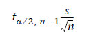
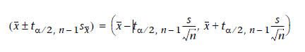

```{r setup, include=FALSE}
knitr::opts_chunk$set(echo = TRUE)

```
# Paquetes
Los paquetes que se van a utilizar para el desarrollo de esta actividad, son los siguientes:
```{r, message=FALSE}
if(!require(Rmisc)){
  install.packages("Rmisc")
  library(Rmisc)
}
```
# 1. Estadística descriptiva 
**Enunciado**: 

*En primer lugar, leed el fichero de datos y verificad que los tipos de datos se interpretan correctamente. Si fuera necesario, haced las oportunas conversiones de tipos.*

*A continuación, realizad una visualización gráfica de los datos del conjunto de datos.*

**Solución**:

En primer lugar, realizamos la lectura del fichero **ChildCarSeats_clean**, aplicando para ello la función *read.csv*.

En este caso, indicaremos como parámetros que el dataset sí tiene header *(header=TRUE)*, que el separador de columnas es la ',' *(sep=",")*, que los strings a interpretar como NA son tanto los campos vacíos, los que tienen un espacio en blanco y en los que aparece la cadena "NA" *(na.strings=c(""," ","NA"))* y por último, que las columnas de tipo String, sean consideradas como factores, ya que todas las columnas que son de tipo String, en este caso son factores.

```{r}
childCarSeats_clean_filename <- "../Data/ChildCarSeats_clean.csv"
childCarSeats_clean <- read.csv(file=childCarSeats_clean_filename, header=TRUE, sep=",", 
                                na.strings=c(""," ","NA"), stringsAsFactors=TRUE)
head(childCarSeats_clean)
str(childCarSeats_clean)

```
Como se puede observar, todos los tipos de las columnas han sido asignagos correctamente.

A continuación, procederemos a realizar una visualización de las diferentes columnas o variables que forman el dataset, para ver como se distribuyen las mismas.

## 1.1 Representación gráfica de variables categóricas o cualitativas
```{r}
unlist(lapply(childCarSeats_clean, is.factor))

```
Como se puede observar, las únicas variables categóricas son: 

* **ShelveLoc**, que indica la calidad de la ubicación de las sillas en la tienda (tres posibles valores: Bad, Good y Medium)
* **Urban**, que indica si la tienda se encuentra en una ubicación urbana o rural (dos posibles valores: Yes y No)
* **US**, que indica si la tienda se encuentra en EUA o no (dos posibles valores: Yes y No)

Para representar gráficamente las variables anteriores, realizaremos un **diagrama de barras** en el caso de la variable **ShelveLoc** y un **diagrama de sectores** para las variables **Urban** y **US**.

La razón por la cual he considerado más oportuno utilizar para las variables Urban y US un diagrama de sectores y no un diagrama de barras, es porque estas solo pueden tomar dos posibles valores, por lo que considero que un diagrama de sectores permitirá captar mejor a simple vista la distribución de las categorías, que si se representa mediante un diagrama de barras.

```{r}
layout(matrix(c(1,1,2,3), 2, 2, byrow = TRUE))


counts <- table(childCarSeats_clean$ShelveLoc)
barplot(counts, main="Distribución de la calidad en cada ubicación",
        xlab="Número de sillitas por cada categoría", col = rainbow
        (length(levels(childCarSeats_clean$ShelveLoc))))

mytableUrban <- table(childCarSeats_clean$Urban)
pctUrban <- round(mytableUrban/sum(mytableUrban)*100)
lblsUrban <- paste(names(mytableUrban), "\n", pctUrban, sep="")
lblsUrban <- paste (lblsUrban, '%', sep="")
pie(mytableUrban, labels = lblsUrban,
    main="Pie Chart of Urban\n")


mytableUS <- table(childCarSeats_clean$US)
pctUS <- round(mytableUS/sum(mytableUS)*100)
lblsUS <- paste(names(mytableUS), "\n", pctUS, sep="")
lblsUS <- paste (lblsUS, '%', sep="")
pie(mytableUS, labels = lblsUS, col=rainbow(length(lblsUS)),
    main="Pie Chart of US\n")
```

* La primera gráfica, nos indica que **la mayoría de las sillas tienen un nivel de calidad de ubicación medio**, y que el grupo que presenta la minoría es el que se corresponde con la calidad de ubicación buena, lo que quiere decir que **sólo una pequeña parte del total de tiendas tienen ubicadas correctamente las sillas**.

* La segunda gráfica empezando por la izquierda, nos indica que **la mayoría de las tiendas analizadas se encuentran en una población urbana**, pues la clase "Yes" representa el 70% de los casos.

* Por último, la última gráfica indica que **la mayoría de las tiendas que se están analizando se encuentran dentro de USA**, pues la clase "Yes", representa un 64%.

## 1.2 Representación gráfica de variables numéricas

```{r}
unlist(lapply(childCarSeats_clean, is.numeric))

```
Como se puede observar, las variables numéricas representan la gran mayoría de las variables del dataset, y estas son:

* **Sales**, que indica el número de ventas unitarias, en miles, en cada ubicación
* **ComPrice**, que indica el precio que cobra la competencia en cada ubicación.
* **Income**, que indica el nivel de ingresos comunitarios, en miles de dólares
* **Adversiting**, que indica el presupuesto de publicidad local de la empresa en cada ubicación, en miles de dólares.
* **Population**, que indica el tamaño de la población en la región, en miles.
* **Price**, que indica el precio de las sillitas de coche en cada ubicación
* **Age**, que indica la edad media de la población local.

Todas ellas son de tipo numérico, pero solo la primera es de tipo decimal, las demás son de tipo entero. Por ello, para representarlas gráficamente, en el caso de la variable **Sales**, la representaremos mediante un diagrama de puntos y en el caso de las demás variables enteras, se representarán mediante un histograma de frecuencias relativas.

La razón por la que se ha decidido representar la variable **Sales** mediante un diagrama de punto es porque al poder tomar valores decimales, esta representación permitirá ver mejor como se distribuyen los diferentes valores, mientras que el histograma nos permitirá ver mejor las demás variables que son de tipo entero.

```{r}
par(mfrow=c(2,4))

dotchart(childCarSeats_clean$Sales,labels=,cex=0.7,
         main="Ventas por ubicación",
         xlab="Ventas por mil", cex.main=0.8, cex.lab=0.8)


colorForHistograms = rainbow(table (unlist(lapply(childCarSeats_clean, 
                                                  is.numeric)))["TRUE"] - 1)

hist(childCarSeats_clean$CompPrice, breaks=sqrt(dim(childCarSeats_clean)[1]), 
     col=colorForHistograms[1],main="Precio que cobra la competencia",
     xlab="Precio en euros",cex.main=0.8, cex.lab=0.8)

hist(childCarSeats_clean$Income, breaks=sqrt(dim(childCarSeats_clean)[1]), 
     col=colorForHistograms[2],main="Nivel de ingresos comunitarios",
     xlab="Nivel de ingresos en miles de dólares",cex.main=0.8, cex.lab=0.8)

hist(childCarSeats_clean$Advertising, breaks=sqrt(dim(childCarSeats_clean)[1]), 
     col=colorForHistograms[3],main="Presupuesto de publicida local",
     xlab="Presupuesto en miles de dólares",cex.main=0.8, cex.lab=0.8)

hist(childCarSeats_clean$Population, breaks=sqrt(dim(childCarSeats_clean)[1]), 
     col=colorForHistograms[4],main="Tamaño de la población",
     xlab="Tamaño de la población en miles",cex.main=0.8, cex.lab=0.8)

hist(childCarSeats_clean$Price, breaks=sqrt(dim(childCarSeats_clean)[1]), 
     col=colorForHistograms[5],main="Precio de las sillitas",
     xlab="Precio en euros",cex.main=0.8, cex.lab=0.8)

hist(childCarSeats_clean$Age, breaks=sqrt(dim(childCarSeats_clean)[1]), 
     col=colorForHistograms[6],main="Edad media de la población",
     xlab="Edad media en años",cex.main=0.8, cex.lab=0.8)

hist(childCarSeats_clean$Education, breaks=sqrt(dim(childCarSeats_clean)[1]), 
col=colorForHistograms[7],main="Media del nivel de educación de la población",
     xlab="Años de educación",cex.main=0.8, cex.lab=0.8)

```

* Si observamos la **primera gráfica** comenzando por la izquierda, podemos observar que la gran mayoría de valores se encuentran acumulados entre 5 y 10, lo que indica que **la gran mayoría de las tiendas venden entre 5 mil y 10 mil sillas**. También se puede observar que existen algunos valores atípicos por encima de 15 mil.

* La **segunda gráfica** se trata de un histograma con una distribución **bimodal** ya que sobresalen dos picos por encima de los demás. Esto indica que existen dos modas presentes en el precio que cobra la competencia, en este caso la primera sería de [120,125) y la segunda de [130,135), lo que quiere decir que **el precio que cobra la competencia tiende a estar en el intervalo [120,125) y en el intervalo [130,135)**

    En este caso, los dos intervalos que representan las dos modas presentes en los datos, se encuentran muy cercanos, por lo que **también podría considerarse un histograma con una distribución unimodal o de forma normal**, donde la moda se encuentra en el **intervalo [120, 135)**.

* La **tercera gráfica** se trata de un histograma con una distribución **uniforme**, lo que indica que no existe una tendencia presente en los datos, es decir, **el nivel de ingresos comunitarios se encuentra distribuido de manera uniforme entre 20 y 120 miles de dólares**.


* La **cuarta gráfica** se trata de un histograma con una distribución **unimodal con asimetría a la derecha**, además de manera **muy pronunciada**. En este caso, la moda se encuentra en el primer intervalo, que corresponde con el intervalo [0,1.5), lo que quiere decir que **la mayoría de las tiendas invierten unos 1500 euros en publicidad local para publicitar las sillitas de bebé**

* La **quinta gráfica** se trata de un histograma con una distribución **uniforme**, lo que nos indica que **el tamaño de la población está distribuido de manera uniforme entre 10 mil que es el mínimo y 509 mil que es el máximo** de población.

* La **sexta gráfica** se trata de un histograma con una distribución **unimodal con una forma normal o simétrico**. En este caso, la moda se encuentra apróximadamente en los tres intervalos centrales, que corresponden con el intervalo [100,130] apróximadamente si juntamos los tres. Esto quiere decir, que **la mayoría de las sillas tienen un precio entre los 100 y los 130 euros apróximadamente**.

* Por último, **tanto la séptima gráfica como la octava**, representan un **histograma con una distribución uniforme**, lo que indica que tanto **la edad media de la población** como **los años de educación** **se reparten de manera uniforme** entre todos sus valores posibles, **en el caso de la edad media entre los 25 y los 70 años**, y **en el caso de los años de educación entre los 10 y los 18 años**.

# 2. Intervalo de confianza de la media poblacional de las ventas
**Enunciado**: *Calculad de manera manual el intervalo de confianza de la media poblacional de las ventas (variable Sales) e interpretar el significado del mismo a partir del resultado obtenido.*

**Solución**:
A continuación, procederemos a realizar el cálculo del intervalo de confianza de la variable **Sales**

## 2.1 Cálculo
Para realizar el cálculo manual de la variable **sales**, utilizaremos varias funciones, entre ellas cabe destacar las siguientes:

* **sd**: En primer lugar utilizaremos la función sd para calcular la desviación estándar de la variable Sales
* **qt**: La función qt la utilizaremos para calcular los valores críticos de la distribución t de Student, la cual recibe como primer parámetro el inverso al nivel de confianza y como segundo parámetro el grado de libertad. En nuestro caso el nivel de confianza por defecto es 95%, por lo que como primer parámetro se pasará el valor **"(1-0.95)/2"** (la razón por la que dividimos entre dos es porque queremos obtener el valor crítico para una prueba bilateral) y como segundo parámetro pasaremos **n - 1** *siendo n la longitud del vector Sales*.

Por último, tras utilizar estas funciones, se aplicará la fórmula del **margen de error** (Figura 1) para calcular el mismo a partir de los valores anteriormente calculados, y posteriormente, poder calcular a partir de este el **intervalo de confianza** (Figura 2).







```{r}
getConfidentInterval<- function(x){
    s = sd(x)
    n = length(x)
    me = abs(qt((1-0.95)/2,n-1 )) * (s/sqrt(n))
    x = mean(childCarSeats_clean$Sales)
    confidenceInterval = c(x-me,x+me)
    return (confidenceInterval)
}
getConfidentInterval(childCarSeats_clean$Sales)


```

Para calcular que el intervalo de confianza de la variable Sales ha sido calculado correctamente, se procede a calcular el mismo a través de la función **CI** del paquete **Rmisc**:

```{r}
CI(childCarSeats_clean$Sales, ci=0.95)

```

Como se puede observar, el componente **lower** devuelto por la función CI, **coincide con el valor inferior** del intervalo que hemos **calculado anteriormente** y el componente **upper, coincide con el valor superior**.

## 2.2 Interpretación 

La interpretación del resultado obtenido como intervalo de confianza es la siguiente: **existe una probabilidad del 95% de que el verdadero valor de la media poblacional de la variable Sales se encuentre entre los valores 7.141372 y 7.678578**

## 2.3 Intervalo de confianza de la media poblacional de Sales en USA y fuera de USA
**Enunciado**:

*Calculad el intervalo de confianza de la media poblacional de Sales en las tiendas de USA y en las tiendas de fuera de USA respectivamente. Comparad los resultados. ¿Podemos concluir que las dos variables tienen medias poblacionales iguales o diferentes? Explicar.*

**Solución**:
A continuación, procedemos a realizar el cálculo del intervalo de confianza en las tiendas de USA y en las tiendas fuera de USA.
```{r}
getConfidentInterval(childCarSeats_clean[childCarSeats_clean$US=='Yes',]$Sales)
getConfidentInterval(childCarSeats_clean[childCarSeats_clean$US=='No',]$Sales)

```
Como se puede ver, los intervalos obtenidos para esta media muestral son diferentes para las tiendas que se encuentran dentro de USA y para las que se encuentran fuera de USA, pero a pesar de ser diferentes tiene muchos valores posibles en común, ya que existen valores comunes en ambos intervalos. Pero realmente contestando a la pregunta de si ***¿Podemos concluir que las dos variables tienen medias poblacionales iguales o diferentes?***, la respuesta sería **negativa**, es decir, no podemos concluir o afirmar que las dos variables tienen medias poblacionales iguales o diferentes porque no podemos asegurar que el resultado de la media poblacional se encuentra realmente entre los intervalos de confianza que hemos obtenido, lo único que podriamos concluir es que con un 95% de probabilidad la media poblacional de ambas se encontrará entre los intervalos calculados, puede que esta media sea la misma (ya que muchos puntos de dichos intervalos son comunes), pero en ningún caso podríamos concluir o asegurar que la media poblacional de ambos casos es igual o diferente.


# 3. Ventas del producto en USA y fuera de USA
**Enunciado**:

*Para evaluar si las ventas del producto son superiores en las tiendas de USA que fuera de USA, podemos aplicar un test de hipótesis de dos muestras. Seguid los pasos que se indican a continuación.*

## 3.1 Hipótesis nula y alternativa

**Enunciado**:

*Escribid la hipótesis nula y la alternativa.*

**Solución**:

* La **hipótesis nula** (de ahora en adelante $H_{0}$) sería: Media Poblacional de ventas del producto dentro de USA (de ahora en adelante $\mu_{DUSA}$) - Media Poblacional de ventas del producto fuera de USA (de ahora en adelante $\mu_{FUSA}$) = 0 ($H_{0}$: $\mu_{DUSA}$ - $\mu_{FUSA}$ = 0) (es decir, que la media poblacional de ventas es la misma tanto dentro de USA como fuera de USA)

* La **hipótesis alternativa** (de ahora en adelante $H_{1}$) sería:  $\mu_{DUSA}$ - $\mu_{FUSA}$ > 0 ($H_{1}$: $\mu_{DUSA}$ - $\mu_{FUSA}$ > 0) (es decir, que la media poblacional de ventas en las tiendas de USA es superior a la media poblacional de ventas en las tiendas fueras de USA)

## 3.2 Test a aplicar

**Enunciado**:

*Revisad si se cumple el supuesto de normalidad para la variable Sales y a partir de este resultado, explicad qué test aplicaréis para el test de hipótesis de dos muestras. Podéis usar los tests y las funciones de R que consideréis necesarios para validar el cumplimiento de condiciones.*

**Solución**:

Para revisar si se cumple el supuesto de normalidad para la variable Sales representaremos esta gráficamente a través de un histograma y de una línea de puntos y veremos si tiene la forma de la distribución normal o similar a esta:

```{r}
x <- childCarSeats_clean$Sales
h<-hist(x, breaks=10, col="red", xlab="Ventas por mil",
        main="Ventas por ubicación")
xfit<-seq(min(x),max(x),length=40)
yfit<-dnorm(xfit,mean=mean(x),sd=sd(x))
yfit <- yfit*diff(h$mids[1:2])*length(x)
lines(xfit, yfit, col="blue", lwd=2)
```

Como se puede observar a través de la gráfica anterior, la distribución muestral de la variable Sales, se distribuye aproximadamente como una muestra normal, podríamos decir que como una distribución t Student, ya que es la distribución más cercana a la normal. Pero además de ello, aplicando el **teorema del límite central**, al tratarse de una muestra bastante grande (n = 400 > 30), sea cual sea la distribución de la variable de interés o de la media poblacional, la **distribución de la media muestral de la variable Sales será aproximadamente como una normal**, siendo la desviación típica de la media muestral aproximadamente el error estándar.

Una vez comprobado que la distribución cumple el supuesto de normalidad, el test que aplicaremos para evaluar si las ventas del producto son superiores en las tiendas de USA que fuera de USA es un **test de hipótesis sobre la diferencia de medias entre las dos muestras a evaluar (ventas fueras de USA y ventas dentro de USA), partiendo del caso de que se desconoce las varianzas poblacionales pero que estas son las mismas **.


## 3.3 Cálculos

**Enunciado**:

*Calculad el test de hipótesis. Debéis desarrollar todos los cálculos con vuestras propias instrucciones. Calculad el valor observado, el valor crítico y el valor p. Al igual que antes, no podéis usar fuciones de R como t.test, pero sí podéis usar funciones como qnorm, pnorm, qt, pt para consultar los valores de las distribuciones normal y t-Student.*

**Solución**:
Para calcular el **test de hipótesis** utilizaremos ciertas funciones desarrolladas que nos permitirán conocer **el valor observado, el valor crítico y el valor p** y a partir de los mismos tomaremos la decisión de si rechazar o aceptar la $H_{0}$.

Las funciones desarrolladas para calcular el valor observado, el valor crítico y el valor p son las siguientes:

```{r}
getComunStd <- function(m1,m2) {
    s1 = sd(m1)
    s2 = sd(m2)
    n1 = length(m1)
    n2 = length(m2)
    comunStd = sqrt( ((n1 - 1)*(s1^2) + (n2-1)*(s2^2) ) / (n1 + n2 -2) )
    return (comunStd)
}
getObservedValue <- function (m1,m2) {
    return ((mean(m1) - mean(m2)) / ( getComunStd(m1,m2) * 
                                        sqrt((1/length(m1)) + (1/length(m2)) ) ) )
}
getCriticalValueStudent <- function(n1,n2) {
    return (qt((1-0.95)/2,(n1+n2-2)))
}
getPValueStudent <- function (tValue, degreesOfFreedom) {
    return (pt(tValue, degreesOfFreedom, lower.tail = TRUE))
}
```

A continuación, se procede a calcular dichos valores:

### 3.3.1 Cálculo del valor observado

```{r}
t = getObservedValue(childCarSeats_clean[childCarSeats_clean$US=='Yes',]$Sales,
                     childCarSeats_clean[childCarSeats_clean$US=='No',]$Sales)

```

En este caso, el valor observado obtenido es igual a `r t`

### 3.3.2 Cálculo del valor crítico

```{r}
c = getCriticalValueStudent(length(childCarSeats_clean[childCarSeats_clean$US=='Yes',]$Sales),
                            length(childCarSeats_clean[childCarSeats_clean$US=='No',]$Sales))
```

En este caso el valor crítico es igual a `r c`

### 3.3.3 Cálculo del p valor

```{r}
df = length(childCarSeats_clean[childCarSeats_clean$US=='Yes',]$Sales) + 
  length(childCarSeats_clean[childCarSeats_clean$US=='No',]$Sales) - 2

p =  1 - getPValueStudent(t, df)

```

Por último, el p valor es igual a `r p`. 

## 3.4 Conclusión

Ya que el p valor es igual a `r p` y se cumple que **p es menor que 0.05**, que es el nivel de significación $\alpha$ fijado por defecto, **rechazamos la $H{0}$**, que decía que **la media poblacional de ventas era la misma en USA y fuera de USA**, y **aprobamos por tanto la $H1{0}$**, que decía que **la media poblacional de ventas dentro de USA era mayor que la media poblacional de ventas fuera de USA**. 

Por lo tanto, podemos concluir que **estos datos confirman que las ventas en USA son superiores a las ventas fuera de USA con un 95% de nivel de confianza, por lo explicado en el párrafo anterior**.

A diferencia de la conclusión obtenida en el **apartado 2.3**, se trata de una conclusión diferente, pues en el caso del apartado 2.3, afirmábamos que **con un 95% de probabilidad las medias poblacionales se encontrarían entre un rango de confianza calculado, y estas podían ser iguales muy probablemente puesto que tenían muchos puntos en común ambos intervalos calculados (intervalo de confianza en las tiendas de USA y de fuera de USA)**. Sin embargo en la conclusión de este apartado obtenemos que: **con un 95% de probabilidad, la media poblacional de ventas dentro de USA supera a la media poblacional de ventas fuera de USA.**


# 4. Ventas en zonas urbanas y rurales 

**Enunciado**:


*Nos preguntamos ahora si las ventas en zonas urbanas son diferentes de las ventas en zonas rurales. Realizad un test de hipótesis de dos muestras para responder esta pregunta. Seguid los mismos pasos que en la sección anterior.**

## 4.1 Hipótesis nula y alternativa

**Enunciado**:

*Escribid la hipótesis nula y la alternativa.*

**Solución**:

* La $H_{0}$ sería: Media poblacional de ventas del producto en zonas urbanas (de ahora en adelante $\mu_{URB}$) - Media poblacional de ventas del producto en zonas rurales (de ahora en adelante $\mu_{RUR}$) = 0 (es decir, que la media poblacional de ventas es la misma tanto en zonas urbanas como en zonas rurales)

* La $H_{1}$ sería: $\mu_{URB}$ - $\mu_{RUR}$ != 0 (es decir, que la media poblacional de ventas en las zonas urbanas es distinta a la de las zonas rurales)

## 4.2 Test a aplicar

**Enunciado**:

*Indicad qué test aplicaréis.*

**Solución**:

Al igual que en el **apartado 3.2**, se aplicará un **test de hipótesis sobre la diferencia de medias entre las dos muestras a evaluar (ventas en zonas rurales y ventas en zonas urbanas), partiendo del caso de que no se conoce las varianzas poblacionales, pero que estas son las mismas**.

## 4.3 Cálculos

**Enunciado**:

*Calculad el test de hipótesis. Debéis desarrollar todos los cálculos con vuestras propias instrucciones. Calculad el valor observado, el valor crítico y el valor p. Al igual que antes, no podéis usar fuciones de R como t.test, pero sí podéis usar funciones como qnorm, pnorm, qt, pt para consultar los valores de las distribuciones normal y t-Student.*

*Si acaso, podéis aprovechar funcionalidades que hayáis desarrollado anteriormente*

**Solución**:

Para calcular el test de hipótesis, se utilizarán las funciones desarrolladas anteriormente en el apartado 3.3, ya que se realizaron de manera general para poder reutilizarlas.

### 4.3.1 Cálculo del valor observado

```{r}
t2 = getObservedValue(childCarSeats_clean[childCarSeats_clean$Urban=='Yes',]$Sales,
                      childCarSeats_clean[childCarSeats_clean$Urban=='No',]$Sales)
```

En este caso, el valor observado obtenido es igual a `r t2`

### 4.3.2 Cálculo del valor crítico

```{r}
c2 = getCriticalValueStudent(length(childCarSeats_clean[childCarSeats_clean$Urban=='Yes',]$Sales),
                             length(childCarSeats_clean[childCarSeats_clean$Urban=='No',]$Sales))
```

En este caso, el valor crítico es igual a `r c2`

### 4.3.3 Cálculo del p valor

```{r}
df2 = length(childCarSeats_clean[childCarSeats_clean$Urban=='Yes',]$Sales) +
length(childCarSeats_clean[childCarSeats_clean$Urban=='No',]$Sales) - 2

p2 = 2 * (1 - getPValueStudent(t2,df2))
```

En este caso, el p valor obtenido es igual a `r p2`

## 4.4 Conclusión

Ya que el p valor es igual a `r p2` y se cumple que p es mayor que 0.05, que es el nivel de significación $\alpha$ fijado por defecto, **no rechazamos la $H_{0}$ a favor de la $H_{1}$**, de manera que **estos datos no confirman que el nivel de ventas en las zonas urbanas sea distinto que el nivel de ventas en las zonas rurales**.

# 5. Estrategia de precios

**Enunciado**: 

*Nos preguntamos si la proporción de tiendas que venden el producto por debajo del precio de la competencia es mayor que las que venden por encima del precio de la competencia.*

*Para responder esta pregunta, se recomienda plantear un test sobre la proporción. Seguid los pasos que se indican a continuación.*

## 5.1 Hipótesis nula y alternativa

**Enunciado**: 

*Escribid la hipótesis nula y la alternativa teniendo en cuenta la pregunta formulada.*

**Solución**:

* La $H_{0}$ sería: Proporción de tiendas que venden el producto por debajo del precio de la competencia (de ahora en adelante $p_{1}$) - Proporción de tiendas que venden el producto por encima del precio de la competencia (de ahora en adelante $p_{2}$) = 0 (es decir, la proporción de tiendas que venden el producto por debajo del precio de la competencia es igual a la proporción de tiendas que vende el producto por encima de la competencia)

* La $H_{1}$ sería: $p_{1}$ - $p_{2}$ > 0 (es decir, que la proporción de tiendas que venden el producto por debajo del precio de la competencia es superior a aquellas que venden el producti por encima del precio de la competencia)

## 5.2 Tipo de test

**Enunciado**: 

*Indicad qué tipo de test aplicaréis y por qué.*

**Solución**:

El tipo de test que aplicaremos para responder a la pregunta cuestionada será un test de hipótesis sobre la diferencia de proporciones, puesto que queremos comparar proporciones y no medias. 

## 5.3 Cálculos

**Enunciado**: 

*Realizad todos los cálculos con instrucciones propias. Calculad el valor observado, el valor crítico y el valor p. Mostrad los resultados. No se pueden usar fuciones de R que resuelvan el cálculo (en todo caso, solo se pueden usar para validar vuestros resultados). Sí podéis usar funciones como qnorm, pnorm, qt, pt para consultar los valores de las distribuciones normal y t-Student.*

**Solución**:

Al igual que en el apartado 3.3, se **procederá a desarrollar** una serie de **funciones** que nos permitirán obtener **el valor observado, el valor crítico y el valor p**.

Las funciones desarrolladas para calcular el valor observado, el valor crítico y el valor p son las siguientes:

```{r}

getCommonPopulationProportion <- function (n1,n2,p1,p2) {
    return((n1*p1 + n2*p2) / (n1+n2))
}

getProportionObservedValue <- function (n1,n2,p1,p2) {
    p = getCommonPopulationProportion(n1,n2,p1,p2)
    stdError = sqrt(p*(1-p)*((1/n1)+(1/n2)))
    z=(p1 - p2)/stdError
    return (z)
}

getCriticalValueNormal <- function() {
    return (abs((qnorm((1-0.95)/2))))
}

getPValueNormal <- function(z) {
    return (pnorm(z,lower.tail = TRUE))
}
```

A continuación, se preocede a calcular dichos valores.

### 5.3.1 Cálculo del valor observado

```{r}
p1 = dim(childCarSeats_clean[childCarSeats_clean$Price < childCarSeats_clean$CompPrice,])[1] / 
  length(childCarSeats_clean$Price)
p2 = dim(childCarSeats_clean[childCarSeats_clean$Price > childCarSeats_clean$CompPrice,])[1] / 
  length(childCarSeats_clean$Price)
n2 = length(childCarSeats_clean$Price)
n1 = length(childCarSeats_clean$Price)
z = getProportionObservedValue(n1,n2,p1,p2)
```

En este caso, el valor obtenido por el valor observado es igual a `r z`

### 5.3.2 Cálculo del valor crítico

```{r}
cnorm = getCriticalValueNormal()
```

En este caso, el valor obtenido por el valor crítico es `r cnorm`, este valor será siempre el mismo en esta práctica, puesto que el nivel de confianza fijado en esta es por defecto es del 95%.

### 5.3.3 Cálculo del p valor

```{r}
pnorm = 1 - getPValueNormal(z)
```

En este caso, el valor obtenido para el p valor es de `r pnorm`.

## 5.4 Conclusión

Ya que el p valor es igual a `r pnorm`, y se cumple que p es menor que 0.05, que es el nivel de significación $\alpha$ dijado por defecto, entonces **rechazamos $H_{0}$ y estamos de acuerdo con el hecho de que la proporción de tiendas que venden el producto por debajo del precio de la competencia es mayor que las que venden por encima del precio de la competencia** (es decir,estamos de acuerdo con $H_{1}$). 

Por lo tanto, respondiendo a la pregunta de *si la proporción de tiendas que venden el producto por debajo del precio de la competencia
es mayor que las que venden por encima del precio de la competencia*, la respuesta sería positiva por lo indicado en el párrafo anterior.


